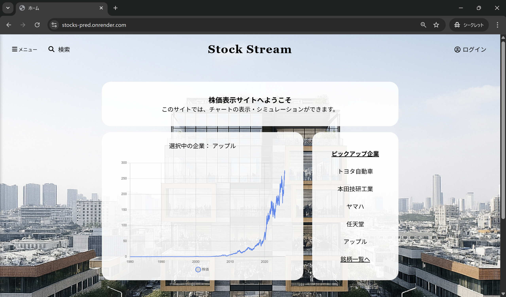
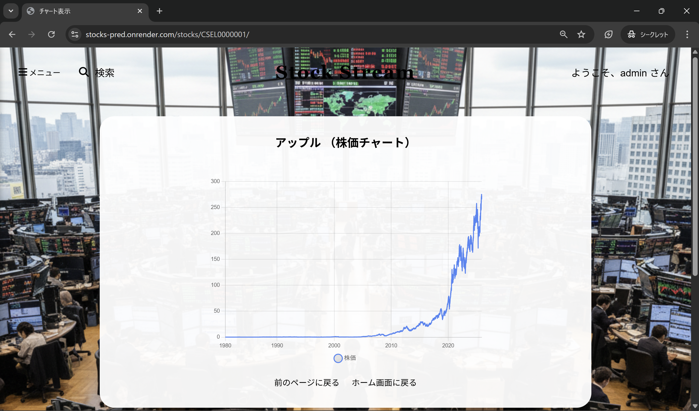
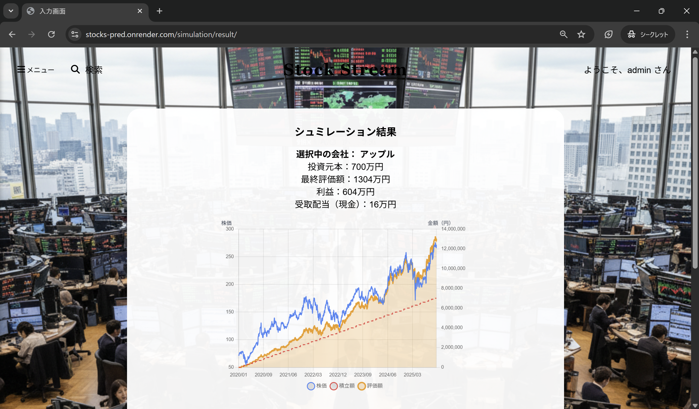
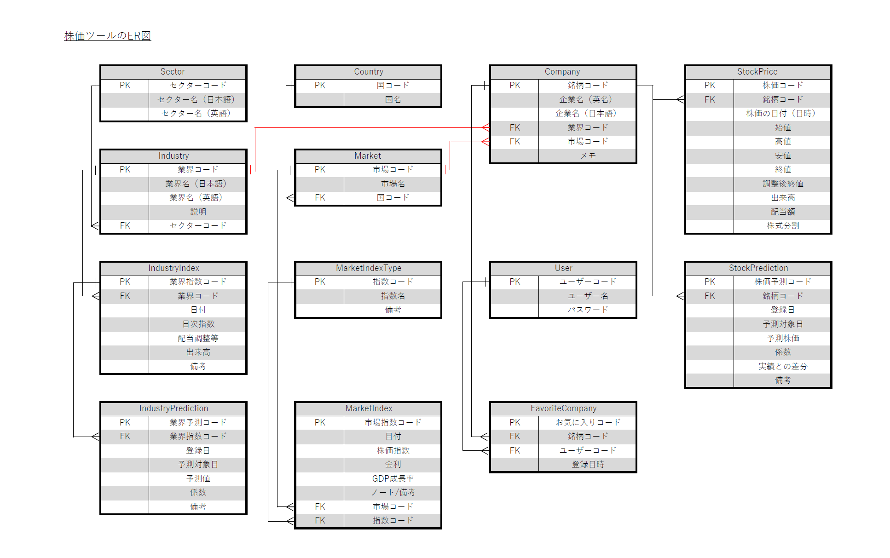

# 株価分析・投資シミュレーションWebアプリ

DjangoとChart.jsを用いて作成した株価分析・投資シミュレーションWebアプリケーションです。  
株価データの可視化・企業管理・投資シミュレーション機能を提供します。

🔗 **公開URL**: https://stocks-pred.onrender.com

#### デモ用アカウント
| 区分 | ユーザー名 | パスワード |
|--------|--------------|-----------|
| 一般ユーザー | user | user78123 |
| 管理者 | admin | Admin167! |

  

## 画面イメージ

### トップ画面

### 株価チャート
Chart.js を用いた株価の表示

### 投資シミュレーション
購入時期を設定して投資結果を検証

### 管理者画面（企業CRUD）
企業の登録・編集・削除

### お問い合わせフォーム
入力 → 確認 → 送信の3ステップ

  

## 使用技術

| カテゴリ | 技術 |
|----------|------|
| フロントエンド | HTML / CSS / JavaScript |
| バックエンド | Python / Django |
| データベース | SQLite3 |
| グラフ描画 | Chart.js |
| メール送信 | Gmail API |
| デプロイ | Render |

  

## 工夫した点

### 誤操作防止を意識したUI設計
- お問い合わせフォーム：入力 → 確認 → 送信で誤送信防止
- 企業削除：選択 → 確認 → 削除で誤削除防止

### フォーム操作の堅牢化
- PRGパターン（Post/Redirect/Get）を採用し二重送信を防止
- セッションチェックで不正アクセス時はリダイレクト

### ユーザー権限管理
- スーパーユーザーを使わず、一般ユーザーに管理者フラグを付与する2段階の権限設計

  

## 機能一覧

### ユーザー管理
- ユーザー登録・ログイン・ログアウト
- 権限管理（一般ユーザー / 管理者）

### 株価チャート表示
- 企業の株価データを折れ線グラフで表示（Chart.js）
- 複数企業の切り替え表示
- レスポンシブ対応（画面幅に応じてラベル間隔を自動調整）

### 投資シミュレーション
- お気に入り登録した企業から銘柄を選択
- 購入時期・売却時期を指定してシミュレーションを作成
- 積立額・評価額・株価を同一グラフで比較表示

### お気に入り企業管理
- 任意の企業をお気に入り登録・解除
- お気に入り企業一覧表示

### 管理者機能（管理者ユーザーのみ）
- 企業データの登録・編集・削除

### お問い合わせフォーム
- 入力 → 確認 → 送信の3ステップ構成
- 送信者・管理者双方にメール通知
  

## データベース構成

| アプリ | モデル | 概要 |
|--------|--------|------|
| accounts | User | Djangoの標準ユーザーモデル |
| stocks | Company | 企業情報 |
| stocks | Industry | 業界分類 |
| stocks | Sector | セクター分類 |
| stocks | Market | 市場情報 |
| stocks | Country | 国情報 |
| stocks | StockPrice | 日次株価（始値・高値・安値・終値・出来高） |
| stocks | MarketIndexType | 市場指数の種類 |
| stocks | MarketIndex | 市場指数の日次データ |
| stocks | IndustryIndex | 業界指数の日次データ |
| predictions | StockPrediction | 企業単位の株価予測データ |
| predictions | IndustryPrediction | 業界単位の予測データ |
| customize | FavoriteCompany | ユーザーのお気に入り企業 |

### ER図

  

## 今後の改善

- 株価データの自動取得
- 投資シミュレーションの拡張（積立・一括・分散など複数の投資戦略に対応）
- UIの強化（洗練されたデザインへの改善）